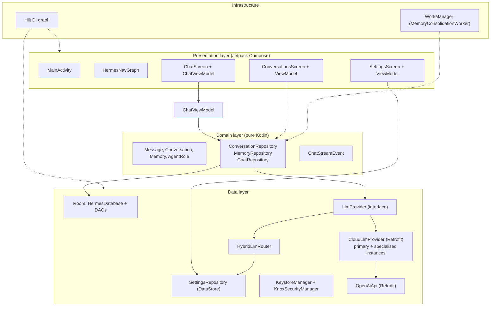
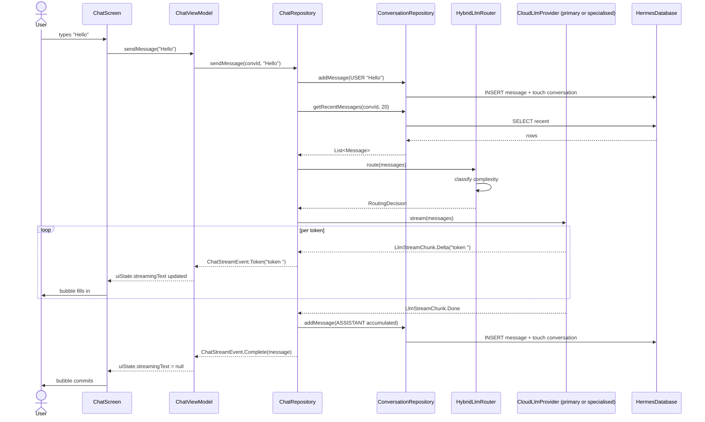
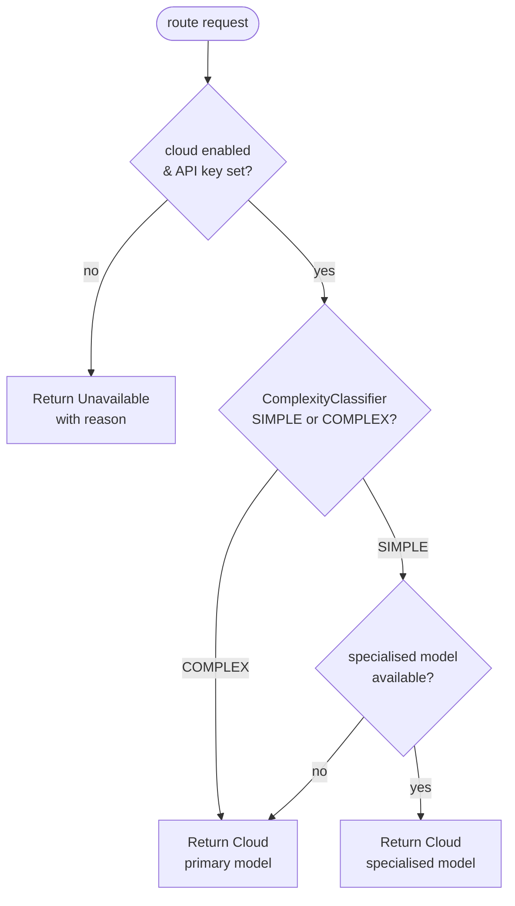
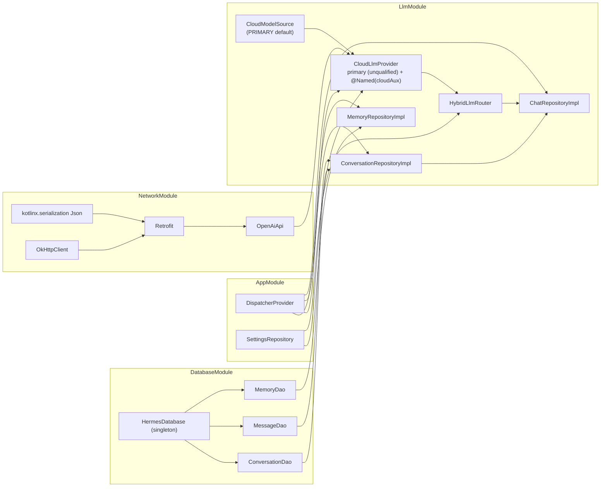
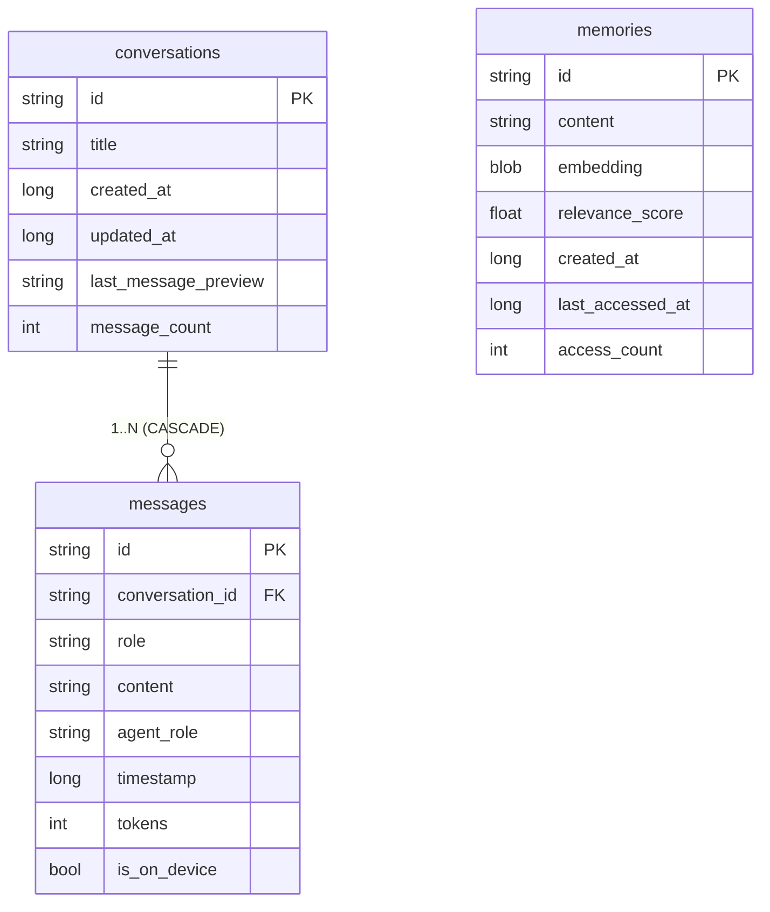
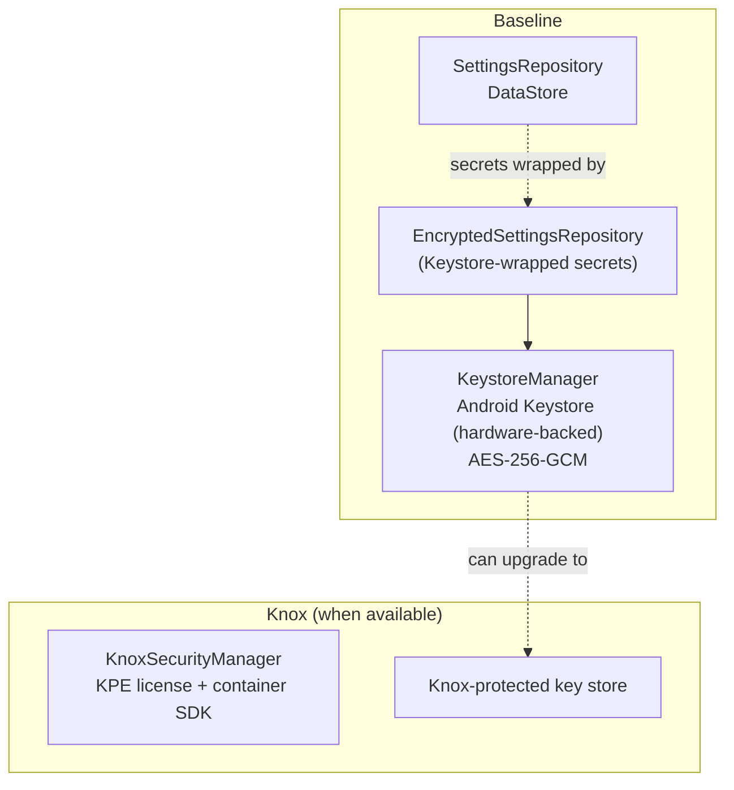
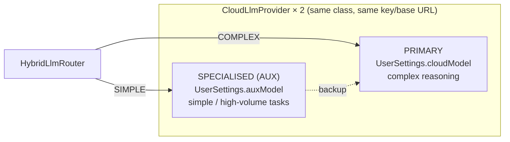

# Architecture

This document describes the runtime architecture of the Hermes Agent Android
app and how it maps back to the technical plan. The diagrams are Mermaid;
GitHub and most IDEs render them inline.

> **Note on on-device inference.** An on-device LLM stack (llama.cpp JNI) was
> prototyped in v0.5.0 and reverted — local inference did not work in practice.
> The app is **cloud-only**. The `HybridLlmRouter` now selects between two
> cloud models (a primary and a specialised model) for different task classes;
> see §3.

## 1. Layered architecture

The app follows a strict layered design with a single allowed dependency
direction: UI → domain ← data. Domain is pure Kotlin (no Android imports);
data implements the domain contracts; UI consumes them through ViewModels.

**Mapping to the plan:**

| Plan section        | Where it lives in this repo                                      |
|---------------------|------------------------------------------------------------------|
| 3.1 High-level arch | Layered structure above                                         |
| 3.2 Orchestration   | `data/agent/OrchestratorImpl.kt` + `data/llm/HybridLlmRouter.kt` |
| 3.3 Plugin system   | `data/plugin/` (in-process + gRPC sandboxes)                    |
| 4.2 Tech components | `gradle/libs.versions.toml` (one entry per row of plan Table 3) |
| 5.1 LLM routing     | `data/llm/HybridLlmRouter.kt` + `CloudModelSource` (primary/specialised cloud models) |
| 5.2 Memory mgmt     | `data/local/HermesDatabase.kt` + `data/performance/MemoryPressureMonitor.kt` |
| 5.4 Battery optim   | `work/MemoryConsolidationWorker.kt` + memory-pressure shedding   |
| 6.1 Multi-agent     | `data/agent/agents/` + `domain/model/AgentRole.kt`              |
| 6.2 Memory system   | `data/repository/MemoryRepositoryImpl.kt` + `data/memory/`      |
| 6.3 RAG pipeline    | `data/rag/RagPipelineImpl.kt`                                   |
| 6.4 Feature matrix  | P0/P1 items shipped                                             |

## 2. Chat send flow

The diagram below traces a single user message from the input bar through
persistence, routing, streaming inference, and back to the UI.

Key design properties of this flow:

- **Cold flow.** `ChatRepository.sendMessage` returns a `Flow<ChatStreamEvent>`
  that is only collected while the ViewModel holds a scope. Cancelling the
  ViewModel job (via the stop button) cancels the upstream provider stream
  too.
- **Persistence is the source of truth.** The streamed tokens are accumulated
  in-memory in the repository, then a single `Message` row is written on
  `Done`. The UI never holds the canonical copy; Room's Flow notifies the
  ViewModel of the new message independently.
- **Errors are surfaced, not thrown.** A mid-stream error emits
  `ChatStreamEvent.Error` and terminates the flow. Any tokens already
  emitted remain visible to the user; the partial reply is *not* persisted.

## 3. LLM routing decision tree

The router picks which cloud model handles each request. Both models are the
same `CloudLlmProvider` class wired twice (see §4): a **primary** instance that
reads `UserSettings.cloudModel` and a **specialised** instance that reads
`UserSettings.auxModel`. They share the same API key and base URL — only the
model id differs.

The classifier (in `data/llm/ComplexityClassifier.kt`) flags a request as
COMPLEX when:

- prompt length > 400 chars, OR
- prompt contains any trigger word (`plan`, `compare`, `summarize`, `design`,
  `brainstorm`, `draft`, `write a long`, `explain in detail`, `step by step`,
  `multi-step`, `evaluate`, `critique`, `outline`, `analysis`, …).

Complex reasoning tasks are routed to the primary (typically larger, more
capable) model; simpler requests go to the lighter specialised model. The
specialised model doubles as a backup: because both share the same credentials,
if it is somehow unavailable the router falls back to the primary. This mirrors
Section 5.1 of the plan, adapted to a two-model cloud setup after on-device
inference was dropped.

## 4. Dependency injection graph

Hilt wires the entire object graph at compile time. The DI modules live in
`di/`; `LlmModule` provides the LLM layer.

The two cloud models are both `CloudLlmProvider`: the **unqualified** binding
resolves to the PRIMARY model (via the default `CloudModelSource` binding) and
is what every direct injector receives, while a `@Named("cloudAux")` binding
provides the specialised (AUX) instance that the router uses for simpler tasks.

## 5. Persistence schema

Room schema. The `messages.is_on_device` column records which provider class
produced each reply so the UI can badge it; with on-device inference removed it
is currently always the cloud value, but the column is retained for forward
compatibility and existing rows.

Indexes:

- `conversations(updated_at)` — drives the "most recent first" ordering on
  the conversations list.
- `messages(conversation_id)` — point lookups by parent conversation.
- `messages(conversation_id, timestamp)` — supports the recent-window query
  used to build LLM prompts.

## 6. Security model

The app ships hardware-backed key storage with optional Samsung Knox
hardening on Knox-capable devices.

Privacy-first defaults (Section 2.3 of the plan):

- Conversations and memories are **excluded from cloud backup** via
  `xml/backup_rules.xml` and `xml/data_extraction_rules.xml`.
- The cloud API key is wrapped via `KeystoreManager` / `EncryptedSettingsRepository`
  before being persisted.
- The cloud provider refuses to call out if `cloudEnabled` is false or the
  API key is blank — see `CloudLlmProvider.isAvailable()`. Both the primary and
  specialised models share this gate.

## 7. Dual cloud model (specialised-task routing)

Rather than one model for everything, the app runs two cloud models behind the
same `LlmProvider` contract so each task class gets an appropriately-sized
model:

The selection is driven by `CloudModelSource` (PRIMARY vs AUX), which controls
which settings field each instance reads. Both models are configured in
Settings (the "Cloud model" and "Specialised model" fields). The rest of the
app — `OrchestratorImpl`, `ChatRepositoryImpl`, the UI — is unaware of which
model answered; it only sees an `LlmProvider`.
