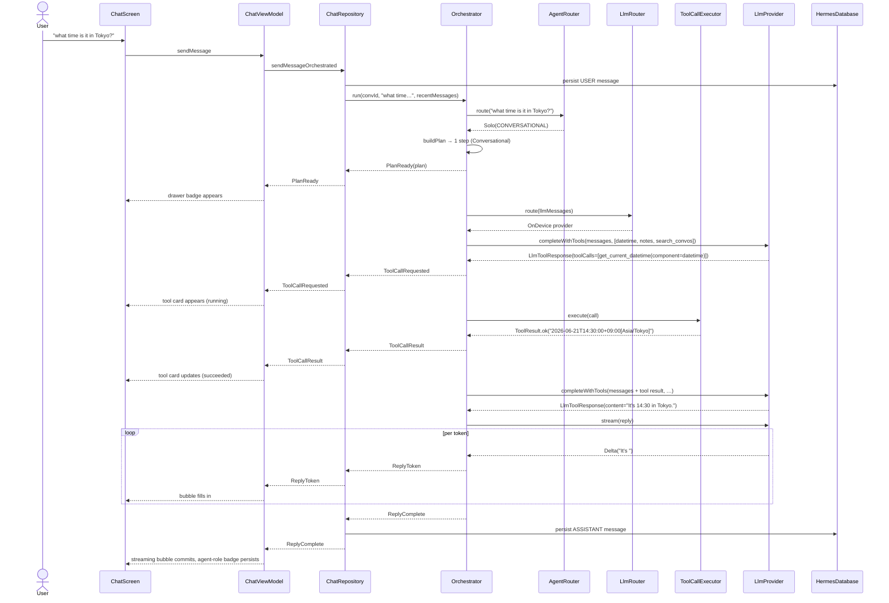

# Phase 2 — Core Agent

This document describes what Phase 2 adds on top of the Phase 1 foundation,
how it maps to Section 7.2 of the technical plan ("Phase 2: Core Agent,
Weeks 7–14"), and what's staged for Phase 3.

> **Status:** Phase 2 complete. Multi-agent orchestration, tool system,
> function calling, enhanced memory, and RAG pipeline are all wired
> end-to-end against mock / stub backends. Production backends (MLC-LLM,
> real embeddings, SQLite-VSS) swap in behind the same contracts in
> Phase 3.

## What's new in Phase 2

### 1. Tool system (plan §6.1, §3.2)

A first-class tool abstraction that lets the LLM invoke structured
capabilities via the OpenAI tool-calling protocol.

- **`domain/tool/Tool.kt`** — `Tool` interface, `ToolDescriptor`,
  `ToolParameter`, `ToolParameterType`, `ToolResult`. Mirrors the
  JSON-Schema function-calling format so it can be sent to any
  OpenAI-compatible backend verbatim.
- **`domain/tool/ToolRegistry.kt`** — read/write registry contract.
- **`data/tool/ToolRegistryImpl.kt`** — in-memory, thread-safe
  implementation.
- **`data/tool/ToolCallExecutor.kt`** — runs `ToolCall`s through the
  registry, with a pluggable confirmation gate for side-effecting tools.

Seven first-party tools shipped under `data/tools/`:

| Tool                    | Category    | Phase 2 behavior                              | Phase 3 swap                  |
|-------------------------|-------------|-----------------------------------------------|-------------------------------|
| `DateTimeTool`          | information | Real — returns device time in any tz          | (no change)                   |
| `CalculatorTool`        | productivity| Real — hand-rolled shunting-yard parser       | Swap in mXparser / exp4j      |
| `WebSearchTool`         | information | Mock — returns canned results                 | Real Serper / Brave / SearXNG |
| `DeviceSettingsTool`    | device      | Real — reads/writes brightness + volume       | Add Wi-Fi, BT, DND, app launch|
| `NotesTool`             | productivity| Real — wraps `MemoryRepository`               | (no change)                   |
| `ConversationSearchTool`| information | Real — linear scan over recent messages       | Room FTS4 virtual table       |
| `CalendarTool`          | productivity| Stub — validates args, returns fake event id  | Android CalendarContract      |

### 2. Function-calling protocol (plan §3.2)

- **`data/llm/ToolCall.kt`** — `ToolCall`, `LlmToolResponse`,
  `LlmFinishReason` models.
- **`data/llm/LlmProvider.kt`** — extended with `completeWithTools`
  and `streamWithTools`. Default implementations fall back to the
  non-tool path so providers that don't support function calling work
  transparently.
- **`OnDeviceLlmProvider`** — synthesizes a `ToolCall` when the user's
  prompt matches a trigger phrase (e.g. "what time is it" →
  `get_current_datetime`). Lets the full function-calling round-trip
  be demoed without a real model.
- **`CloudLlmProvider`** — real `completeWithTools` implementation
  that sends the `tools` array as raw JSON via a new
  `OpenAiApi.completionRaw` endpoint, then parses `tool_calls` out of
  the response.
- **`OpenAiApi`** — new `completionRaw` method accepts a raw
  `RequestBody` so callers can attach fields not modeled in
  `ChatCompletionRequest`.

### 3. Multi-agent orchestration (plan §6.1)

The intellectual core of Phase 2. Decomposes user requests across a
team of specialized agents.

- **`domain/agent/Agent.kt`** — `Agent` interface with role, system
  prompt, available tools, canHandle, postProcess.
- **`domain/agent/AgentRouter.kt`** — intent classification contract.
- **`domain/agent/Orchestrator.kt`** — plan-then-execute contract,
  plus the full `OrchestratorEvent` sealed class
  (`PlanReady`, `StepStarted`, `ToolCallRequested`,
  `ToolCallResult`, `StepFinished`, `ReplyToken`, `ReplyComplete`,
  `Failed`, `StateChanged`).
- **`domain/model/ExecutionPlan.kt`** — `ExecutionPlan`, `ExecutionStep`,
  `StepStatus`, `AgentRun`, `AgentRunPhase`.
- **`data/agent/HeuristicIntentClassifier.kt`** — keyword + length
  based router. Recognizes multi-agent patterns
  ("search X then draft Y" → Research + Creative).
- **`data/agent/AgentRegistry.kt`** — `AgentRole` → `Agent` lookup.
- **`data/agent/OrchestratorImpl.kt`** — the main loop: route → plan →
  per-step tool-call loop (max 3 rounds) → stream reply.

Five specialized agents under `data/agent/agents/`:

| Agent               | Role                  | Tool access                                       |
|---------------------|-----------------------|---------------------------------------------------|
| ConversationalAgent | CONVERSATIONAL        | datetime, notes, search_conversations             |
| ProductivityAgent   | PRODUCTIVITY          | datetime, calendar, notes, search_conversations   |
| ResearchAgent       | RESEARCH              | web_search, search_conversations, notes           |
| DeviceControlAgent  | DEVICE_CONTROL        | device_settings, datetime                         |
| CreativeAgent       | CREATIVE              | notes, search_conversations                       |

Tool access policy is centralized in `AgentToolAccess.kt` for auditability.

### 4. Memory system (plan §6.2)

Dual-store memory: short-term sliding window + long-term semantic store.

- **`data/memory/EmbeddingService.kt`** — embedding contract.
- **`data/memory/HashingEmbeddingService.kt`** — Phase 2 mock:
  deterministic SHA-256 → 384-dim L2-normalized vector. Fast,
  reproducible, but semantically meaningless.
- **`data/memory/VectorStore.kt`** + **`InMemoryVectorStore.kt`** —
  in-memory brute-force cosine similarity.
- **`data/memory/ShortTermMemory.kt`** — sliding window with per-
  conversation token budget (defaults: 30 turns / 4096 tokens).
- **`data/memory/MemoryConsolidator.kt`** — extracts "remember that X"
  and "I prefer Y" patterns from conversations; persists them as
  long-term memories.
- **`data/repository/MemoryRepositoryImpl.kt`** — extended to embed
  every new memory and register it in the VectorStore. `searchMemories`
  now does hybrid vector + keyword search.
- **`work/MemoryConsolidationWorker.kt`** — real body: enumerates all
  conversations, runs the consolidator, prunes the store. Runs daily
  while charging + idle.

### 5. RAG pipeline (plan §6.3)

Document ingestion, chunking, indexing, and hybrid retrieval.

- **`domain/rag/Document.kt`** — `Document`, `Chunk`, `RetrievedChunk`,
  `RetrievalSource`.
- **`domain/rag/RagPipeline.kt`** — `ingest`, `deleteDocument`,
  `observeDocuments`, `retrieve`, `buildContext`.
- **`data/rag/DocumentChunker.kt`** — recursive text splitter
  respecting paragraph → line → sentence → word → char hierarchy.
- **`data/rag/Bm25Scorer.kt`** — Okapi BM25 with k1=1.5, b=0.75.
- **`data/rag/RagPipelineImpl.kt`** — full pipeline. Hybrid retrieval
  (70% vector + 30% BM25), cold-start hydration from Room.
- **`data/local/entity/DocumentEntity.kt`** + **`DocumentChunkEntity.kt`** —
  new Room tables.
- **`data/local/dao/DocumentDao.kt`** + **`DocumentChunkDao.kt`** —
  CRUD + observation.
- **`HermesDatabase.MIGRATION_1_2`** — Room schema v1 → v2 migration.

### 6. UI updates

- **`ui/chat/components/AgentRoleBadge.kt`** — chip showing which agent
  produced the current reply (Conversational / Productivity / Research /
  Device Control / Creative).
- **`ui/chat/components/ToolCallCard.kt`** — inline card showing each
  tool invocation with status icon, arguments preview, output preview.
- **`ui/chat/components/MessageBubble.kt`** — Phase 2 update: streaming
  bubble now includes agent badge + tool-call cards above the typing
  text.
- **`ui/chat/ChatScreen.kt`** — Phase 2 update: modal drawer showing
  the current execution plan with per-step status indicators.
- **`ui/memory/MemoryScreen.kt`** — new screen: list / add / delete
  long-term memories.
- **`ui/documents/DocumentsScreen.kt`** — new screen: list / ingest /
  delete RAG documents.
- **`ui/navigation/`** — bottom-nav extended with Memory + Documents
  tabs.

### 7. DI wiring

Four new Hilt modules:

- **`di/ToolsModule.kt`** — constructs the 7 tools and registers them
  into the `ToolRegistry`.
- **`di/AgentsModule.kt`** — binds `AgentRouter` and `Orchestrator`.
- **`di/MemoryModule.kt`** — binds `EmbeddingService` and `VectorStore`.
- **`di/RagModule.kt`** — binds `RagPipeline`.

### 8. Tests

- **`data/tool/ToolRegistryImplTest.kt`** — registry CRUD + sorting.
- **`data/tool/ToolCallExecutorTest.kt`** — execution, error surfacing,
  confirmation gate, batch.
- **`data/agent/HeuristicIntentClassifierTest.kt`** — routing rules
  incl. multi-agent pattern.
- **`data/memory/MemoryConsolidatorTest.kt`** — fact extraction,
  preference patterns, ignore-assistant-messages, end-to-end
  consolidation.
- **`data/rag/RagPipelineImplTest.kt`** — ingest, retrieve empty,
  buildContext empty.
- **`data/rag/DocumentChunkerTest.kt`** — paragraph/sentence/word
  splitting + merge.

## End-to-end flow

A Phase 2 user message round looks like this:



## What's still stubbed (Phase 3 targets)

| Subsystem              | Phase 2 state                              | Phase 3 swap                                     |
|------------------------|--------------------------------------------|--------------------------------------------------|
| On-device LLM          | Mock canned replies                        | MLC-LLM + Snapdragon NPU (Qualcomm AI Engine Direct SDK) |
| Embeddings             | SHA-256 hashing (no semantic meaning)      | all-MiniLM-L6-v2 quantized via MLC-LLM / ONNX-RT |
| Vector store           | In-memory brute-force cosine               | SQLite-VSS virtual table backed by Room BLOB col |
| Streaming              | Non-streaming call sliced into per-token   | Retrofit SSE converter for real `text/event-stream` |
| Intent classification  | Keyword + length heuristic                 | Lightweight on-device classifier model           |
| Memory consolidation   | Regex-based "remember that X" extraction   | LLM-based summarization of conversation turns    |
| Web search             | Canned results                             | Real Serper / Brave / SearXNG API                |
| Calendar               | Stub — no system write                     | Android CalendarContract provider                |
| Conversation search    | Linear scan over recent messages           | Room FTS4 virtual table                          |
| Plugin system          | Not started                                | gRPC sandbox + signed APK modules                |
| Voice I/O              | Not started                                | Android SpeechRecognizer + TTS                   |

## How to demo Phase 2

1. **Build & install** as in Phase 1 (`./gradlew installDebug`).
2. **Open the app** → Conversations tab → tap + to start a new chat.
3. **Try a tool-triggering prompt**:
   - "what time is it in Tokyo?" → Conversational agent + DateTime tool.
   - "calculate (15 + 27) * 4" → Conversational agent + Calculator tool.
   - "remember that I prefer dark mode" → Conversational agent + Notes tool.
   - Watch the agent-role badge appear above the streaming bubble.
   - Watch the tool-call card appear with a running → succeeded indicator.
4. **Try a multi-agent prompt**:
   - "search for recent EU AI Act news then draft a short summary memo"
   - The plan drawer should show two steps (Research → Creative).
5. **Memory tab**:
   - Tap the Memory tab in the bottom nav.
   - Add a memory manually ("I'm vegetarian").
   - It's now persisted and will be retrievable via the Notes tool.
6. **Documents tab**:
   - Tap the Documents tab.
   - Tap + to add a document (any text — try a paragraph from a news article).
   - The document is chunked + indexed. In Phase 3, the Research agent will
     retrieve from this corpus to ground its replies.
7. **Settings** → observe new "Phase 1 (Foundation)" label changed to
   "Phase 2 (Core Agent)" under About.

## Files added in Phase 2

```
domain/
├── agent/
│   ├── Agent.kt
│   ├── AgentRouter.kt
│   └── Orchestrator.kt
├── model/
│   └── ExecutionPlan.kt        (new)
├── rag/
│   ├── Document.kt             (new)
│   └── RagPipeline.kt          (new)
└── tool/
    ├── Tool.kt                 (new)
    └── ToolRegistry.kt         (new)

data/
├── agent/
│   ├── AgentRegistry.kt        (new)
│   ├── HeuristicIntentClassifier.kt (new)
│   ├── OrchestratorImpl.kt     (new)
│   └── agents/
│       ├── AgentToolAccess.kt  (new)
│       ├── ConversationalAgent.kt (new)
│       ├── ProductivityAgent.kt (new)
│       ├── ResearchAgent.kt    (new)
│       ├── DeviceControlAgent.kt (new)
│       └── CreativeAgent.kt    (new)
├── llm/
│   ├── LlmProvider.kt          (extended)
│   ├── OnDeviceLlmProvider.kt  (extended)
│   ├── CloudLlmProvider.kt     (extended)
│   └── ToolCall.kt             (new)
├── local/
│   ├── HermesDatabase.kt       (v2 + MIGRATION_1_2)
│   ├── dao/DocumentDao.kt      (new)
│   └── entity/
│       ├── DocumentEntity.kt   (new)
│       └── DocumentChunkEntity.kt (new)
├── memory/
│   ├── EmbeddingService.kt     (new)
│   ├── HashingEmbeddingService.kt (new)
│   ├── InMemoryVectorStore.kt  (new)
│   ├── MemoryConsolidator.kt   (new)
│   ├── ShortTermMemory.kt      (new)
│   └── VectorStore.kt          (new)
├── rag/
│   ├── Bm25Scorer.kt           (new)
│   ├── DocumentChunker.kt      (new)
│   └── RagPipelineImpl.kt      (new)
├── remote/
│   └── OpenAiApi.kt            (extended with completionRaw)
├── repository/
│   ├── ChatRepositoryImpl.kt   (extended with sendMessageOrchestrated)
│   └── MemoryRepositoryImpl.kt (extended with embeddings + vector search)
├── tool/
│   ├── ToolCallExecutor.kt     (new)
│   └── ToolRegistryImpl.kt     (new)
└── tools/
    ├── CalculatorTool.kt       (new)
    ├── CalendarTool.kt         (new)
    ├── ConversationSearchTool.kt (new)
    ├── DateTimeTool.kt         (new)
    ├── DeviceSettingsTool.kt   (new)
    ├── NotesTool.kt            (new)
    └── WebSearchTool.kt        (new)

di/
├── AgentsModule.kt             (new)
├── DatabaseModule.kt           (extended)
├── MemoryModule.kt             (new)
├── RagModule.kt                (new)
└── ToolsModule.kt              (new)

ui/
├── chat/
│   ├── ChatScreen.kt           (extended — plan drawer)
│   ├── ChatUiState.kt          (extended — plan + toolCalls)
│   ├── ChatViewModel.kt        (extended — orchestrator events)
│   └── components/
│       ├── AgentRoleBadge.kt   (new)
│       ├── MessageBubble.kt    (extended — agent badge + tool cards)
│       └── ToolCallCard.kt     (new)
├── documents/
│   ├── DocumentsScreen.kt      (new)
│   └── DocumentsViewModel.kt   (new)
├── memory/
│   ├── MemoryScreen.kt         (new)
│   └── MemoryViewModel.kt      (new)
└── navigation/
    ├── HermesNavGraph.kt       (extended — Memory + Documents routes)
    └── TopLevelDestination.kt  (extended)

work/
└── MemoryConsolidationWorker.kt (real body)

test/
├── data/agent/HeuristicIntentClassifierTest.kt (new)
├── data/memory/MemoryConsolidatorTest.kt (new)
├── data/rag/RagPipelineImplTest.kt (new)
├── data/rag/DocumentChunkerTest.kt (new)
├── data/tool/ToolCallExecutorTest.kt (new)
└── data/tool/ToolRegistryImplTest.kt (new)
```
