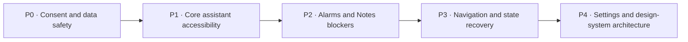

# Jeeves Page-by-Page UI/UX Re-audit

**Audit date:** 11 July 2026

**Baseline:** `4cbdfaf` (`v0.9.2`)

**Scope:** every discoverable host destination, dialog, embedded Notes surface, and Alarms surface. This re-audit verifies the findings in [`UI_UX_VISUAL_REPORT_2026-07-10.md`](UI_UX_VISUAL_REPORT_2026-07-10.md) against the current code after commit `9fede85`.

**Method:** static Kotlin/Compose/View/XML inspection, navigation tracing, state and error-flow review, Material accessibility heuristics, and comparison of current implementation to the previous evidence. No emulator or Android device was connected, so contrast, focus order, clipping, TalkBack speech timing, and animation behavior still require runtime validation.

---

## Executive delta

The recent pass fixed several real problems: recent conversations now open directly, the navigation label is now **Chats**, the API token is masked, theme selection has radio semantics, chat no longer always forces the scroll position, embedded feature splashes are bypassed, and three destructive flows now confirm.

The work is incomplete in four important ways:

1. **The permission fix is not present in current code.** Onboarding still launches seven permissions in one request and discards the result, despite `PROGRESS.md` describing per-capability consent as finished.
2. **Safety is inconsistent.** Confirmations protect conversations, skills, and host plugins, but not tickets, documents, memory, learned facts, connectors, schedules, delegated tasks, logs, Notes plugins, or alarms.
3. **The assistant still exposes operator complexity too early.** Chat permanently shows Terminal/Subagents, and Settings is a 1,300+ line mixture of everyday preferences, credentials, servers, SSH, backup, and self-evolution.
4. **Notes and Alarms contain the strongest accessibility risks.** Notes exposes dead toolbar controls and a pointer-only drawing canvas; Alarms uses non-scrollable layouts, undersized day selectors, and continuous wake-screen motion.

### Current severity picture

| Severity | Current assessment | Release implication |
|---|---|---|
| 🔴 Critical | No code-confirmed universal blocker | Runtime accessibility testing can still reveal blockers |
| 🟠 High | 14 priority clusters | Resolve before broader beta or accessibility claim |
| 🟡 Medium | Repeated across most secondary pages | Plan as the next product-quality milestone |
| 🔵 Low | Copy, icon, density, and architectural polish | Fix alongside touched surfaces |

---

## Status of every previous finding

| Prior ID | Status now | Evidence-based disposition |
|---|---|---|
| UX-001 | ❌ Open | Permissions are still assembled and launched together; result callback is empty: [`OnboardingScreen.kt:176`](../app/src/main/kotlin/com/hermes/agent/ui/onboarding/OnboardingScreen.kt#L176). |
| UX-002 | 🟨 Partial | Conversations, Skills, and host Plugins confirm; many other destructive pages still delete immediately. |
| UX-003 | ✅ Fixed | Home passes the selected `thread.id` to chat: [`HomeScreen.kt:197`](../app/src/main/kotlin/com/hermes/agent/ui/home/HomeScreen.kt#L197). |
| UX-004 | 🟨 Partial | Search is debounced, but repository browsing is launched outside the cancellable search collection: [`SessionBrowserViewModel.kt:34`](../app/src/main/kotlin/com/hermes/agent/ui/sessions/SessionBrowserViewModel.kt#L34). |
| UX-005 | ✅ Fixed | Token is masked and regeneration confirms: [`SettingsScreen.kt:813`](../app/src/main/kotlin/com/hermes/agent/ui/settings/SettingsScreen.kt#L813). |
| UX-006 | 🟨 Partial | Completed bubbles merge semantics; streaming still changes a polite live region token by token: [`MessageBubble.kt:104`](../app/src/main/kotlin/com/hermes/agent/ui/chat/components/MessageBubble.kt#L104). |
| UX-007 | 🟨 Partial | Settings target is corrected; tappable eyes and the Home “Open” action remain weak: [`HomeScreen.kt:80`](../app/src/main/kotlin/com/hermes/agent/ui/home/HomeScreen.kt#L80). |
| UX-008 | 🟨 Partial | Root contrast/type and some reduced motion are wired; not every animation follows the policy. |
| UX-009 | ✅ Fixed in code | Host passes embedded mode and both feature activities bypass their standalone transition. |
| UX-010 | 🟨 Partial | Shared typography moved to `core:theme`; Notes still owns a separate Serif/Sans/Mono scale. |
| UX-011 | 🟨 Partial | Startup and Chats now show spinners, but lack useful spoken labels; Chats error has no Retry. |
| UX-012 | ✅ Fixed | Chat follows only when the user is near the bottom: [`ChatScreen.kt:93`](../app/src/main/kotlin/com/hermes/agent/ui/chat/ChatScreen.kt#L93). |
| UX-013 | ❌ Open | Device-scan error exists in state but is not rendered by the screen. |
| UX-014 | ❌ Open | Host Settings remains one single-scroll page: [`SettingsScreen.kt:112`](../app/src/main/kotlin/com/hermes/agent/ui/settings/SettingsScreen.kt#L112). |
| UX-015 | ✅ Fixed | Bottom navigation now says **Chats**: [`TopLevelDestination.kt:24`](../app/src/main/kotlin/com/hermes/agent/ui/navigation/TopLevelDestination.kt#L24). |
| UX-016 | ❌ Open | Board remains a top-level destination while related work features remain buried. |
| UX-017 | ✅ Fixed | Kanban status and priority are non-interactive surfaces: [`KanbanChips.kt:31`](../app/src/main/kotlin/com/hermes/agent/ui/kanban/KanbanChips.kt#L31). |
| UX-018 | ✅ Fixed | Theme choices expose radio role and selected state. |
| UX-019 | 🟨 Partial | Host sliders expose state; Butler's Sass slider does not. |
| UX-020 | ❌ Open | Large amounts of host, Notes, and Alarms copy remain hard-coded. |
| UX-021 | ❌ Open | Fixed 11–12 sp labels and rigid layouts remain throughout Home, Onboarding, Notes, and Alarms. |
| UX-022 | 🟨 Partial | Skills has guidance but no clear load/error distinction; Plugins still has a blank zero state. |
| UX-023 | 🟨 Partial | Shared tokens improved, but Butler XML and Compose theme paths can still drift. |
| UX-024 | 🟨 Partial | Typography is shared more widely; shape and motion roles are not a complete cross-module contract. |
| UX-025 | ❌ Open | Personal profile fields are still collected together without optional/retention context. |
| UX-026 | ✅ Fixed | Bottom-nav icons are decorative and labels provide the accessible name. |
| UX-027 | ❌ Open | `SlimTopBar` remains one-line and ellipsized. |
| UX-028 | ❌ Open | Home hero still uses a legacy accent, hard-coded white, and fixed local type. |
| UX-029 | ✅ Fixed | The main legacy palette cleanup was completed in the post-audit theme work. |
| UX-030 | 🟨 Partial | Notes/Alarms subtitles improved; quick actions still reuse the same diamond glyph. |

**Prior-audit total:** 9 fixed, 12 partial, 9 open.

---

## 🟠 High-severity findings

### H-01 — Onboarding still uses bulk consent and ignores the outcome

The screen launches microphone, notification, fine/coarse location, contacts, calendar, camera, and Termux permissions as one array, while the callback discards every result: [`OnboardingScreen.kt:176`](../app/src/main/kotlin/com/hermes/agent/ui/onboarding/OnboardingScreen.kt#L176). Continue remains available regardless of denied or permanently denied state.

**Fix:** one capability card at a time with status, rationale, **Allow**, **Not now**, and Settings recovery. Ask at point of use wherever practical.

### H-02 — Onboarding completion can silently lose profile memory

The finish workflow swallows memory-write failures and proceeds to mark onboarding complete: [`OnboardingViewModel.kt:79`](../app/src/main/kotlin/com/hermes/agent/ui/onboarding/OnboardingViewModel.kt#L79). The button has no saving, partial-failure, or retry state.

**Fix:** model `Idle / Saving / PartialFailure / Complete`; disable duplicate taps; explain which data failed and allow retry or informed continuation.

### H-03 — Conversation search is only partially cancellable

Debounce and latest-query collection were added, but `executeSearch()` calls a repository method that launches independent work, so an older browse can still outlive the newer query: [`SessionBrowserViewModel.kt:34`](../app/src/main/kotlin/com/hermes/agent/ui/sessions/SessionBrowserViewModel.kt#L34).

**Fix:** perform the repository read in the same `flatMapLatest`/`collectLatest` chain, keep previous results visible, and render inline progress.

### H-04 — Streaming accessibility can announce every token

The streaming bubble is a polite live region whose accessible description changes with generated text: [`MessageBubble.kt:104`](../app/src/main/kotlin/com/hermes/agent/ui/chat/components/MessageBubble.kt#L104).

**Fix:** announce “Jeeves is responding” once, keep token updates silent, then announce the completed message once. Test with TalkBack speech interruption enabled.

### H-05 — Chat exposes an operator console as primary navigation

Chat permanently displays Chat/Terminal/Subagents mode controls: [`ChatScreen.kt:191`](../app/src/main/kotlin/com/hermes/agent/ui/chat/ChatScreen.kt#L191). Subagents does not have a distinct content branch and falls into the ordinary chat path.

**Fix:** keep conversation primary; move Terminal and agent diagnostics into an overflow or developer drawer. Implement Subagents as a real destination before exposing it.

### H-06 — Destructive-action protection is not system-wide

Immediate deletion remains in Ticket, Documents, Memory, Learning, Messaging, Schedule, Delegate, and Logs. Representative evidence: [`TicketDetailScreen.kt:56`](../app/src/main/kotlin/com/hermes/agent/ui/kanban/TicketDetailScreen.kt#L56), [`DocumentsScreen.kt:87`](../app/src/main/kotlin/com/hermes/agent/ui/documents/DocumentsScreen.kt#L87), [`MemoryScreen.kt:100`](../app/src/main/kotlin/com/hermes/agent/ui/memory/MemoryScreen.kt#L100), [`CronScreen.kt:83`](../app/src/main/kotlin/com/hermes/agent/ui/cron/CronScreen.kt#L83).

**Fix:** use the shared destructive dialog consistently, name the object and consequence, and prefer reversible soft-delete/Snackbar Undo where possible.

### H-07 — Messaging secrets are visible text fields

Connector tokens/secrets use ordinary visible text fields: [`ConnectScreen.kt:208`](../app/src/main/kotlin/com/hermes/agent/ui/connect/ConnectScreen.kt#L208).

**Fix:** password transformation, explicit reveal control, autofill/content semantics, per-provider validation, and connection-test feedback.

### H-08 — Settings remains an unscalable god surface

The page mixes cloud model credentials, chat, appearance, alarms, features, local API, SSH, backup, self-evolution, security, and About in one 1,300+ line screen: [`SettingsScreen.kt:99`](../app/src/main/kotlin/com/hermes/agent/ui/settings/SettingsScreen.kt#L99).

**Fix:** searchable category landing with Assistant, Appearance, Connections, Automation, Privacy & Security, Advanced, and About subpages. Architecturally, split state and UI by responsibility rather than creating more branches in this file.

### H-09 — Notes exposes controls that do nothing

Editor toolbar actions including Add, More, decrease size, Undo, Redo, Tag, and Options are present with empty callbacks: [`NoteApp.kt:2071`](../feature/jotter/src/main/java/com/l3ad3r1/octojotter/ui/NoteApp.kt#L2071).

**Fix:** remove the actions until implemented or render disabled state with a concise reason. Never expose a focusable no-op.

### H-10 — Notes drawing is pointer-only

The drawing surface is a fixed pointer canvas without an accessible alternative or meaningful semantics: [`NoteApp.kt:2249`](../feature/jotter/src/main/java/com/l3ad3r1/octojotter/ui/NoteApp.kt#L2249).

**Fix:** label the canvas and drawing state, support image import and captions/alt text, and offer a non-drawing path for equivalent note content.

### H-11 — Alarms cannot be visibly edited or deleted from the list

The screen receives `onDelete` but does not expose it; the edit sheet is never opened for an existing alarm: [`MainAlarmSetupActivity.kt:55`](../feature/butler/src/main/kotlin/com/sassybutler/alarm/MainAlarmSetupActivity.kt#L55).

**Fix:** make each alarm row open Edit, add a labelled overflow action, and confirm/undo deletion.

### H-12 — Alarms main screen is non-scrollable

Clock, header, alarm list, preview action, and FAB live in a fixed Column: [`MainAlarmSetupActivity.kt:160`](../feature/butler/src/main/kotlin/com/sassybutler/alarm/MainAlarmSetupActivity.kt#L160).

**Fix:** `Scaffold` with inset-aware FAB and `LazyColumn`; verify 200% text, landscape, gesture navigation, and short screens.

### H-13 — Add/Edit Alarm can hide controls and exposes undersized day selectors

The sheet is a non-scroll Column, while one-letter day controls are 40 dp raw clickables without selected/checkbox semantics: [`AddAlarmSheet.kt:61`](../feature/butler/src/main/kotlin/com/sassybutler/alarm/AddAlarmSheet.kt#L61), [`AddAlarmSheet.kt:111`](../feature/butler/src/main/kotlin/com/sassybutler/alarm/AddAlarmSheet.kt#L111).

**Fix:** scrollable Material bottom sheet with IME/navigation padding and 48 dp FilterChips/selectable group using full day state descriptions.

### H-14 — Wake screen ignores reduced motion and large-text constraints

The screen combines an 80 sp clock, fixed layout, typewriter text, and infinite pulse animations: [`AlarmActivity.kt:118`](../feature/butler/src/main/kotlin/com/sassybutler/alarm/AlarmActivity.kt#L118).

**Fix:** adaptive display sizing, scroll-safe/reflowing layout, full static greeting for accessibility services, and a system reduced-motion path with no looping pulse.

---

## Page-by-page review matrix

### Jeeves host and assistant

| Page/surface | Status | Current UI/UX issues and fix direction |
|---|---|---|
| Startup | 🟡 Partial | Spinner exists but has no “Loading Jeeves” semantics/copy; model settings-load failure explicitly. |
| Welcome | 🟡 | Completion callback mutates state during composition; use `LaunchedEffect`. Fixed typography must reflow at 200%. |
| Profile onboarding | 🟠 | Over-collects address, phone, email, and routine without optional/privacy context; use progressive profiling. |
| Permission onboarding | 🟠 | Bulk request, discarded result, no permanent-denial recovery; redesign per H-01. |
| Device onboarding | 🟡 | ViewModel error is not rendered; add error, Retry, and Skip. |
| Home | 🟡 Partial | Recent routing fixed; eyes remain an unnamed action, “Open” lacks a robust target, hero type/tokens remain rigid. |
| Bottom navigation | 🟢 Improved | Chats label and icon semantics fixed. Board-vs-Work architecture remains unresolved. |
| Chats/search | 🟠 Partial | Search cancellation incomplete; full-page loading and raw error with no Retry; delete action competes with row click. |
| Chat conversation | 🟠 Partial | Auto-follow fixed; no “Jump to latest”; streaming speech, generic Snackbar, and operator tabs remain. |
| Execution-plan drawer | 🟡 | Good progressive disclosure when a plan exists; verify focus trap, close announcement, and back behavior on device. |
| Terminal/install panel | 🟡 | “Check” and “Reinstall” are small text targets; Run can be available for unknown install state. Use labelled buttons and explicit state. |

### Work, memory, and capability pages

| Page/surface | Status | Current UI/UX issues and fix direction |
|---|---|---|
| Board | 🟡 | Fixed-width nested scrolling is poor on phones; assignee remains a no-op chip; view toggle lacks target-state label. |
| Ticket detail | 🟠 | Immediate delete, non-scroll body, no Loaded/NotFound/Error split, and actionless tag/assignee chips. |
| Artifacts/Documents | 🟠 | Immediate delete; initial load and true empty state are indistinguishable; add ingestion progress and empty CTA. |
| Memory | 🟠 | Privacy-sensitive delete is immediate; no loading/error distinction; blank Add action remains possible. |
| Learning | 🟠 | Fact deletion is immediate; blank Save is enabled. Rebuild progress is a good pattern to reuse. |
| Skills | 🟡 Partial | Delete confirmation fixed; empty guidance still depends on “+”; no load/error/retry distinction; tag chip is a no-op. |
| Host Plugins | 🟡 Partial | Uninstall confirmation fixed; zero state lacks marketplace/install CTA and explicit load/error state. |
| Refine Skill | 🟢/🟡 | Working/success/error and constraint gating are good; long proposal needs expandable diff/copy presentation. |
| Messaging/Connect | 🟠 | Visible secrets, immediate delete, generic incomplete validation. Add masked fields and per-provider requirements/test. |
| Schedule/CRON | 🟠 | Immediate delete; expression only checks nonblank. Parse it and preview next runs with timezone. |
| Delegate | 🟠 | Delete conflates cancel/history removal; result truncates at three lines without detail, copy, or retry. |
| Experiment | 🟡 | Model IDs are free text with no discovery or validation. Per-column progress/error feedback is good. |
| Logs | 🟠/🟡 | Clear is immediate; four equal actions compress at large text. Confirm clear and move secondary actions to overflow. |
| Secondary navigation | 🟡 | Several Settings-launched pages hide the bottom bar but expose no visible Back action; system Back is the only exit. Pass a common `onBack` to every secondary page. |

### Notes

| Page/surface | Status | Current UI/UX issues and fix direction |
|---|---|---|
| Notes list | 🟡 | 24 dp tag chips with 11 sp text are fragile; preserve standard chip target and scalable typography. |
| Search/filter/folders | 🟡 | Dense icon-led controls need 200% text and TalkBack focus-order verification; localize all labels. |
| Note editor | 🟠 | Multiple dead toolbar controls; hard-coded light/dark icon colors can violate theme contrast. Remove no-ops and use semantic tokens. |
| Task board | 🟡 | 36 dp task toggle and no-op tag chips; use 48 dp controls and real filter/badge semantics. |
| Drawing | 🟠 | Pointer-only canvas; provide accessible alternative and meaningful canvas state. |
| Tags/folders dialogs | 🟡 | Dense chip/icon workflow needs large-text reflow and explicit selected/removal semantics. |
| Trash | 🟡 | Empty-trash is destructive; verify confirmation, exact consequence, and recovery policy. |
| History/versions | 🟡 | Restore actions need confirmation when replacing current content and a clear preview of the selected version. |
| Sync status | 🟡 | Technical state dominates; translate failures into action-oriented copy with Retry and account/repository context. |
| Notes Settings | 🟠 | Another long settings model duplicates shared theme/security concepts. Deep-link shared preferences to Jeeves and retain Notes-only sync controls. |
| Community plugins | 🟠 | Removal remains immediate in this feature surface; add named confirmation and load/error recovery. |
| Debug log | 🔵 | 11 sp log text and four top-bar actions are dense; allow text scaling, wrap actions in overflow, preserve copy/share. |

### Alarms

| Page/surface | Status | Current UI/UX issues and fix direction |
|---|---|---|
| Alarm list / “Parlour” | 🟠 | No visible edit/delete workflow, fixed non-scroll layout, weak zero state, raw Preview text, automatic location request. |
| Add alarm | 🟠 | Non-scroll sheet and 40 dp one-letter day selectors; add Material selected semantics and adaptive scrolling. |
| Edit alarm | 🟠 | Existing flow is not reachable from list; sheet deletion is immediate. Make row edit discoverable and protect delete. |
| Preferences | 🟡 | Sass lacks value description; honorific/snooze selection relies on color; use semantic single-choice controls. |
| Voice choice/download | 🟡 | Verify download progress, failure, retry, storage cost, and offline state with screen-reader announcements. |
| Wake screen | 🟠 | Fixed 80 sp clock, looping motion, raw low-emphasis Snooze text. Reflow, respect reduced motion, and use a secondary Button. |

---

## Cross-cutting medium-severity issues

### Navigation and recovery

- Secondary pages opened from Settings often have no visible Back button while the bottom bar is hidden.
- Loading, empty, not-found, and error states are frequently represented by the same blank or spinner state.
- Snackbar errors rarely offer contextual Retry and are dismissed before the user resolves the cause.
- Destructive behavior needs one product-wide policy, not page-by-page adoption.

### Material accessibility

- Fixed type sizes, one-line truncation, and non-scroll Columns remain common.
- Raw `clickable` text and 36–42 dp controls remain in host, Notes, and Alarms.
- Several actionless chips and dead controls create false affordances and unnecessary accessibility focus stops.
- Selection is still encoded by color alone in Butler preferences.
- Reduced motion is implemented locally instead of through one injected theme/motion policy.

### Product language and architecture

- Hard-coded user-facing strings block complete localization, RTL, and consistent TalkBack language.
- `SettingsScreen.kt` and `NoteApp.kt` are god surfaces with multiple unrelated reasons to change, increasing regression risk.
- Host, Notes, and Alarms share more tokens than before, but do not yet share a complete semantic contract for shape, spacing, motion, state, and accessibility.

---

## 🔵 Low-severity polish

- Home quick actions still use the same diamond for unrelated capabilities.
- `SlimTopBar` truncates titles to one line.
- Technical labels such as CRON, model identifiers, chunk counts, and raw errors need user-oriented explanations.
- Notes debug/log typography is very small.
- Several toggles and icon descriptions name the control but not its next state.
- Empty pages should include one primary task, not just a zero counter.
- Decorative icons should remain excluded from the accessibility tree when adjacent text already names the item.
- Theme and contrast parity should be protected with automated token tests and a screenshot matrix.

---

## Recommended execution order

| Phase | Deliverables |
|---|---|
| P0 | Real per-permission onboarding; apply confirmation/Undo policy to every destructive surface; mask connector secrets. |
| P1 | Streaming announcement policy; hide operator tabs by default; labelled loading/error/Retry states; Home semantics. |
| P2 | Remove dead Notes controls; accessible drawing alternative; reachable alarm editing; scroll-safe alarm and wake layouts; reduced motion. |
| P3 | Visible Back on all secondary pages; cancellable search; load/empty/error state models; validated CRON/connectors. |
| P4 | Split Settings and NoteApp by responsibility; searchable settings IA; shared semantic type/shape/space/motion/accessibility contract. |

---

## Required device validation

- [ ] TalkBack: onboarding denial/recovery, chat streaming, tool progress, Notes editor, alarm creation, and wake screen.
- [ ] Switch Access: Home, Chat, Board, Notes editor, Add Alarm, Preferences, and destructive dialogs.
- [ ] Font scale: 100%, 130%, 150%, and 200% at 360 dp width and landscape.
- [ ] Motion: system animation scale 0 and Remove animations enabled.
- [ ] Themes: explicit Jeeves Light/Dark versus system mode across host, Notes, and Alarms.
- [ ] Contrast: bodySmall, labelSmall, disabled controls, error states, and Snooze/secondary actions.
- [ ] Focus: dialogs, bottom sheets, keyboard/IME, back navigation, Snackbar actions, and returning focus after deletion.
- [ ] Screenshot matrix: every page above in light/dark, empty/content/error, and large-text states.

## Product-design conclusion

Jeeves is materially better than the 10 July baseline, but it is not yet one coherent assistant experience. The next quality gain will come from applying the good fixes **systemically**: one consent model, one destructive-action policy, one state/recovery language, one accessibility/motion policy, and one cross-module design contract.
