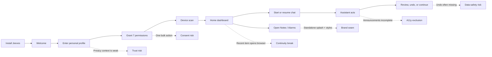
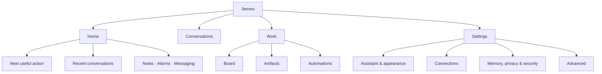

# Jeeves UI/UX Visual Audit

**Audit date:** 10 July 2026
**Product:** Jeeves digital assistant for Android
**Scope:** host app, onboarding, home, chat, conversations, settings, board, Notes, and Alarms
**Method:** static Compose/View code review, Material Design and WCAG-oriented heuristic review, navigation and state-flow inspection, plus comparison with the earlier [`UX_AUDIT.md`](UX_AUDIT.md). No emulator or device was connected during this pass, so visual-runtime and TalkBack findings are explicitly listed for validation rather than presented as device-tested facts.

---

## Executive summary

Jeeves has a strong technical foundation and several well-considered assistant interactions, but its experience still feels like a power-user console containing three products rather than one calm, dependable assistant. The most important risks are **trust**, **accessibility**, and **workflow continuity**:

- Onboarding asks for seven sensitive permissions in one action while promising separate choice.
- Destructive actions can happen without confirmation or undo.
- Home's recent conversations do not open the conversation the user selected.
- Core assistant responses and loading states are not reliably announced to screen-reader users.
- Settings mixes everyday preferences with infrastructure and developer controls in one long page.
- Notes and Alarms still reveal their standalone product origins through splashes, typography, and token drift.

### Severity snapshot

| Severity | Count | Meaning | Release guidance |
|---|---:|---|---|
| 🔴 Critical | 0 | Confirmed blocker causing immediate harm or making the core flow unusable | None confirmed by static review |
| 🟠 High | 10 | Trust, accessibility, data-safety, or core-flow failure | Address before broad beta |
| 🟡 Medium | 15 | Repeated friction, inconsistency, or exclusion risk | Schedule in the next UX milestone |
| 🔵 Low | 5 | Polish and resilience improvements | Resolve opportunistically |

### Experience health map

| Area | Current signal | Main reason |
|---|---|---|
| Onboarding & trust | 🟠 Needs intervention | Permission batching and premature personal-data collection |
| Home & navigation | 🟠 Needs intervention | Unlabelled controls and broken recent-thread destination |
| Chat & assistant feedback | 🟠 Needs intervention | Screen-reader announcements and aggressive auto-scroll |
| Safety & recovery | 🟠 Needs intervention | Immediate destructive actions and weak retry paths |
| Settings architecture | 🟡 Needs restructuring | Consumer preferences and developer infrastructure are mixed |
| Visual system | 🟡 Needs consolidation | Typography, shapes, and feature-module tokens diverge |
| Material accessibility | 🟠 Needs intervention | Missing semantics, undersized targets, and reduced-motion gaps |

---

## Product journey: where trust is lost

### Recommended information architecture

This keeps the four-destination bottom bar, but changes it from a mixture of features (`Search`, `Board`) into stable user intentions. Developer-oriented controls move behind **Advanced**.

---

## 🟠 High severity

### UX-001 — Permission consent is bundled and the copy contradicts the behavior

**Evidence:** [`OnboardingScreen.kt:176`](../app/src/main/kotlin/com/hermes/agent/ui/onboarding/OnboardingScreen.kt#L176) lists microphone, notifications, location, contacts, calendar, camera, and Termux access, then launches them as one array at lines 198–216. The supporting copy says each is requested separately.

**Impact:** users cannot make an informed choice, denial rates increase, and the mismatch damages trust at first launch.

**Fix:** replace the bulk button with individual permission cards showing **why**, **current status**, **Allow**, and **Not now**. Ask in context: microphone when voice is first used, contacts when messaging is configured, camera when image capture is invoked, and Termux only when the local agent feature is enabled.

### UX-002 — Destructive actions have no confirmation or undo

**Evidence:** session deletion in [`SessionBrowserScreen.kt:231`](../app/src/main/kotlin/com/hermes/agent/ui/sessions/SessionBrowserScreen.kt#L231), skill deletion in [`SkillsScreen.kt:161`](../app/src/main/kotlin/com/hermes/agent/ui/skills/SkillsScreen.kt#L161), and plugin removal in [`PluginsScreen.kt:71`](../app/src/main/kotlin/com/hermes/agent/ui/plugins/PluginsScreen.kt#L71) invoke deletion directly.

**Impact:** an accidental tap can permanently remove meaningful user data or capability configuration.

**Fix:** use a named confirmation for irreversible deletion (“Delete ‘Trip planning’?”) or soft-delete followed by a Snackbar with **Undo**. Keep the action outside the row's primary tap target.

### UX-003 — A recent conversation does not open the selected conversation

**Evidence:** every recent row calls the same `onOpenConversations` callback in [`HomeScreen.kt:178`](../app/src/main/kotlin/com/hermes/agent/ui/home/HomeScreen.kt#L178) and [`HomeScreen.kt:257`](../app/src/main/kotlin/com/hermes/agent/ui/home/HomeScreen.kt#L257); the navigation graph only supplies the conversation-browser route at [`HermesNavGraph.kt:94`](../app/src/main/kotlin/com/hermes/agent/ui/navigation/HermesNavGraph.kt#L94).

**Impact:** the dashboard promises one-tap continuation but adds another search-and-select step.

**Fix:** make `ThreadRow` return the conversation ID and navigate directly to `chat/{conversationId}`. Keep “View all” as the route to the browser.

### UX-004 — Conversation search can show stale results and blanks content while typing

**Evidence:** search triggers on query changes in [`SessionBrowserScreen.kt:95`](../app/src/main/kotlin/com/hermes/agent/ui/sessions/SessionBrowserScreen.kt#L95), while independent searches are launched in [`SessionBrowserViewModel.kt:56`](../app/src/main/kotlin/com/hermes/agent/ui/sessions/SessionBrowserViewModel.kt#L56).

**Impact:** older, slower responses can replace newer results; the list flickers or disappears during normal typing.

**Fix:** model the query as a `StateFlow`, debounce 250–350 ms, use `flatMapLatest`, keep existing results visible, and show a small inline progress indicator rather than a blank page.

### UX-005 — The local API bearer token is exposed by default

**Evidence:** the local API section renders the token in clear text and offers regeneration without confirmation in [`SettingsScreen.kt:822`](../app/src/main/kotlin/com/hermes/agent/ui/settings/SettingsScreen.kt#L822).

**Impact:** shoulder-surfing, screenshots, or screen sharing can leak a credential; accidental regeneration silently breaks connected clients.

**Fix:** mask by default, add a time-limited **Reveal** action, confirm regeneration with its consequence, and show “Copied” feedback without echoing the token.

### UX-006 — Chat content is not exposed as reliable screen-reader utterances

**Evidence:** message and streaming content are visually composed without merged message semantics or live-region behavior in [`MessageBubble.kt:49`](../app/src/main/kotlin/com/hermes/agent/ui/chat/components/MessageBubble.kt#L49) and [`TypingIndicator.kt:36`](../app/src/main/kotlin/com/hermes/agent/ui/chat/components/TypingIndicator.kt#L36).

**Impact:** TalkBack users can hear fragmented tokens, miss newly generated content, or struggle to distinguish user, assistant, and tool messages.

**Fix:** merge each completed bubble into one semantic node; announce role, content, and status; use a polite live region for completion rather than every token; expose tool-call state as “Searching, in progress / complete / failed.”

### UX-007 — Home's primary controls are unnamed or too small

**Evidence:** the animated eyes and quick-action surfaces use raw `clickable` at [`HomeScreen.kt:75`](../app/src/main/kotlin/com/hermes/agent/ui/home/HomeScreen.kt#L75); Settings is a 42 dp circle containing only “A” at lines 97–107; “Open” is a bare text action at lines 236–252.

**Impact:** TalkBack announces ambiguous content, Switch Access lacks meaningful roles, and targets fall below the 48 dp minimum.

**Fix:** use Material `IconButton`, `Card`, and `TextButton` components or add explicit role, label, focus, and click semantics. Enforce `minimumInteractiveComponentSize()` while keeping visible icons compact.

### UX-008 — Accessibility support code is not connected to the theme, and motion cannot be reduced

**Evidence:** high-contrast and boosted-typography helpers exist in [`Accessibility.kt:31`](../app/src/main/kotlin/com/hermes/agent/ui/theme/Accessibility.kt#L31), but `HermesTheme` does not apply them in [`Theme.kt:84`](../app/src/main/kotlin/com/hermes/agent/ui/theme/Theme.kt#L84). Continuous eyes and typing motion run in [`ExpressiveEyes.kt:61`](../app/src/main/kotlin/com/hermes/agent/ui/components/ExpressiveEyes.kt#L61) and [`TypingIndicator.kt:41`](../app/src/main/kotlin/com/hermes/agent/ui/chat/components/TypingIndicator.kt#L41).

**Impact:** the app advertises accessibility behavior that users do not receive; animation can trigger discomfort or distraction.

**Fix:** wire font-scale and contrast behavior at the root theme, respect the system animator-duration scale, provide static states, and test at 200% font size with TalkBack and Switch Access.

### UX-009 — Embedded Notes and Alarms still feel like separate apps

**Evidence:** both modules retain their own splash themes and startup behavior: [`feature/jotter/themes.xml:7`](../feature/jotter/src/main/res/values/themes.xml#L7), [`feature/jotter/MainActivity.kt:21`](../feature/jotter/src/main/java/com/l3ad3r1/octojotter/MainActivity.kt#L21), [`feature/butler/themes.xml:17`](../feature/butler/src/main/res/values/themes.xml#L17), and [`MainAlarmSetupActivity.kt:59`](../feature/butler/src/main/kotlin/com/sassybutler/alarm/MainAlarmSetupActivity.kt#L59).

**Impact:** every transition breaks the “one assistant” mental model and adds perceived delay.

**Fix:** pass an `EXTRA_EMBEDDED` flag from Jeeves and skip feature splashes for in-app navigation. Retain standalone splashes only for legitimate external entry points such as sharing.

### UX-010 — The visual system still speaks three typographic languages

**Evidence:** the host uses Geist in [`app/theme/Type.kt:12`](../app/src/main/kotlin/com/hermes/agent/ui/theme/Type.kt#L12), Notes uses generic Serif/Sans/Monospace in [`feature/jotter/theme/Type.kt:9`](../feature/jotter/src/main/java/com/l3ad3r1/octojotter/ui/theme/Type.kt#L9), and Alarms mixes Cinzel, Playfair Display, and DM Sans in [`activity_main.xml:51`](../feature/butler/src/main/res/layout/activity_main.xml#L51).

**Impact:** hierarchy, density, and brand voice change between adjacent capabilities.

**Fix:** define shared Jeeves roles for display, title, body, label, and mono in `core:theme`. Reserve the expressive Alarms typeface for one display moment; use the shared body and control typography everywhere else.

---

## 🟡 Medium severity

| ID | Issue and evidence | User impact | Recommended fix |
|---|---|---|---|
| UX-011 | Startup and session loading can render blank surfaces: [`MainActivity.kt:67`](../app/src/main/kotlin/com/hermes/agent/MainActivity.kt#L67), [`SessionBrowserScreen.kt:121`](../app/src/main/kotlin/com/hermes/agent/ui/sessions/SessionBrowserScreen.kt#L121). | The app appears frozen; screen readers receive no status. | Show a branded, non-looping progress state with “Loading Jeeves” / “Loading conversations” semantics. |
| UX-012 | Chat scrolls to the latest item on every streaming update: [`ChatScreen.kt:92`](../app/src/main/kotlin/com/hermes/agent/ui/chat/ChatScreen.kt#L92). | Users reading earlier content are repeatedly pulled away. | Auto-follow only when already near the bottom; otherwise show **Jump to latest**. |
| UX-013 | Device-scan failure collapses back to the initial state: [`OnboardingViewModel.kt:61`](../app/src/main/kotlin/com/hermes/agent/ui/onboarding/OnboardingViewModel.kt#L61), [`OnboardingScreen.kt:238`](../app/src/main/kotlin/com/hermes/agent/ui/onboarding/OnboardingScreen.kt#L238). | Failure looks like an ignored tap. | Add explicit error copy, Retry, and Skip; preserve any partial results. |
| UX-014 | Settings is one long page combining chat, appearance, alarms, features, API server, SSH, backup, evolution, updates, security, and About: [`SettingsScreen.kt:120`](../app/src/main/kotlin/com/hermes/agent/ui/settings/SettingsScreen.kt#L120). | Everyday controls are buried and advanced settings feel dangerous. | Create searchable subpages: Assistant, Appearance, Connections, Automation, Privacy & Security, Advanced, About. |
| UX-015 | `Search` is the bottom-nav label for conversations: [`TopLevelDestination.kt:24`](../app/src/main/kotlin/com/hermes/agent/ui/navigation/TopLevelDestination.kt#L24). | Navigation describes an operation, not the destination or user's content. | Rename to **Chats** or **Conversations**; keep search inside that destination. |
| UX-016 | Board sits beside Home and Settings while other work features are buried in Settings: [`HermesNavGraph.kt:39`](../app/src/main/kotlin/com/hermes/agent/ui/navigation/HermesNavGraph.kt#L39). | Information architecture reflects implementation prominence rather than user goals. | Use **Work** as a destination grouping Board, Artifacts, Automations, and delegated tasks. |
| UX-017 | Status and priority `AssistChip`s are focusable but have no action: [`KanbanChips.kt:25`](../app/src/main/kotlin/com/hermes/agent/ui/kanban/KanbanChips.kt#L25). | They imply interactivity and create dead keyboard/TalkBack stops. | Render non-interactive badges, or make them real selectors with selected/state semantics. |
| UX-018 | Theme cards communicate selection visually but lack radio/selected semantics: [`SettingsScreen.kt:560`](../app/src/main/kotlin/com/hermes/agent/ui/settings/SettingsScreen.kt#L560). | Nonvisual users cannot reliably identify the active theme. | Use a selectable group with `Role.RadioButton`, `selected`, and meaningful labels. |
| UX-019 | Sass and snooze sliders expose labels without human-readable values: [`SettingsScreen.kt:695`](../app/src/main/kotlin/com/hermes/agent/ui/settings/SettingsScreen.kt#L695). | TalkBack users hear an abstract control rather than its effect. | Add steps and `stateDescription`, e.g. “Sass 40 percent” and “Snooze 10 minutes.” |
| UX-020 | User-facing and accessibility strings are hard-coded across Home, Chat, and Settings: [`HomeScreen.kt:106`](../app/src/main/kotlin/com/hermes/agent/ui/home/HomeScreen.kt#L106), [`ChatInputBar.kt:65`](../app/src/main/kotlin/com/hermes/agent/ui/chat/components/ChatInputBar.kt#L65). | Localized screens become mixed-language and TalkBack labels remain English. | Move all visible and semantic text to resources; add pseudo-locale and RTL checks. |
| UX-021 | Small fixed type (including 11–12 sp) and one-line truncation appear in important UI: [`HomeScreen.kt:118`](../app/src/main/kotlin/com/hermes/agent/ui/home/HomeScreen.kt#L118), [`Type.kt:73`](../app/src/main/kotlin/com/hermes/agent/ui/theme/Type.kt#L73). | Large-text users lose context or encounter clipped labels. | Prefer Material type tokens, avoid fractional 11.5 sp text, allow critical values to wrap, and test at 200%. |
| UX-022 | Skills and plugins have weak loading/empty affordances: [`SkillsScreen.kt:53`](../app/src/main/kotlin/com/hermes/agent/ui/skills/SkillsScreen.kt#L53), [`PluginsScreen.kt:37`](../app/src/main/kotlin/com/hermes/agent/ui/plugins/PluginsScreen.kt#L37). | Empty can be mistaken for loading; “+” depends on icon literacy. | Add skeleton/loading states and an empty-state primary action such as **Add your first skill**. |
| UX-023 | The “one palette” still has manually mirrored Butler values that differ from core tokens: [`JeevesColorSchemes.kt:36`](../core/theme/src/main/kotlin/com/jeeves/core/theme/JeevesColorSchemes.kt#L36), [`butler/colors.xml:4`](../feature/butler/src/main/res/values/colors.xml#L4). | Small drift compounds across surfaces and future changes. | Generate View XML tokens from one source or add parity tests for every semantic color role. |
| UX-024 | Shape ownership is fragmented between host, Notes defaults, and Butler XML: [`Shape.kt:7`](../app/src/main/kotlin/com/hermes/agent/ui/theme/Shape.kt#L7), [`butler/themes.xml:44`](../feature/butler/src/main/res/values/themes.xml#L44). | Sheets, cards, and fields look unrelated. | Move named shape roles to `core:theme` and mirror the same roles for Views. |
| UX-025 | Onboarding asks for address, phone, email, and routine before marking fields optional or explaining retention: [`OnboardingScreen.kt:145`](../app/src/main/kotlin/com/hermes/agent/ui/onboarding/OnboardingScreen.kt#L145). | Users may overshare before trust is established. | Apply progressive profiling, mark optional fields, explain local/cloud storage, and collect data only when a capability needs it. |

---

## 🔵 Low severity

| ID | Issue | Suggested fix |
|---|---|---|
| UX-026 | Bottom-navigation icons repeat the adjacent label to TalkBack: [`HermesNavGraph.kt:64`](../app/src/main/kotlin/com/hermes/agent/ui/navigation/HermesNavGraph.kt#L64). | Set decorative icon descriptions to `null`; let `NavigationBarItem` text provide the name. |
| UX-027 | `SlimTopBar` forces a single-line title: [`SlimTopBar.kt:52`](../app/src/main/kotlin/com/hermes/agent/ui/components/SlimTopBar.kt#L52). | Permit wrapping or expand height under large font scale and long locales. |
| UX-028 | The Home hero uses a legacy accent, hard-coded white, and local type sizes: [`HomeScreen.kt:110`](../app/src/main/kotlin/com/hermes/agent/ui/home/HomeScreen.kt#L110). | Replace it with a reusable hero component driven by semantic gradient, content, and type tokens. |
| UX-029 | Legacy Midnight, Paper, and old Hermes colors remain beside the shared palette: [`Color.kt:23`](../app/src/main/kotlin/com/hermes/agent/ui/theme/Color.kt#L23). | Reference-sweep and remove unused tokens; keep feature-only status colors in focused files. |
| UX-030 | Notes and Alarms quick actions share the same glyph, and “Alarms / Alarms” repeats its label: [`HomeScreen.kt:151`](../app/src/main/kotlin/com/hermes/agent/ui/home/HomeScreen.kt#L151). | Use distinctive note and alarm icons, with outcome-oriented subtitles such as “Capture ideas” and “Wake-ups & reminders.” |

---

## Recommended redesign direction

### 1. Make Home an assistant briefing, not a launcher

The first viewport should answer three questions:

1. **What needs my attention?** Next alarm, failed task, permission recovery, or awaiting clarification.
2. **What can I continue?** One-tap recent conversations that open directly.
3. **What can Jeeves do?** Three or four task-based suggestions, not a grid of internal modules.

Suggested order: assistant status → attention card → primary prompt → recent work → capabilities.

### 2. Make permission and automation behavior explainable

Every sensitive action should expose:

- what Jeeves wants to do;
- which data or permission it needs;
- whether execution is local or cloud-based;
- what will happen next;
- how to undo, revoke, or inspect the result.

### 3. Separate daily settings from operator settings

| Daily settings | Advanced/operator settings |
|---|---|
| Assistant name and voice | LLM endpoint and model routing |
| Appearance and text size | Local API server and bearer token |
| Notifications and reminders | Remote shell / SSH |
| Memory and privacy controls | Logs, exports, self-evolution |
| Connected services | Experimental model comparison |

### 4. Establish one cross-module design contract

Use `core:theme` as the source for color, typography, shapes, spacing, motion, and accessibility behavior. Compose features consume the contract directly; View-based Alarms receives generated or parity-tested XML equivalents. Feature personality may change illustrations and display accents, but not body text, control geometry, focus behavior, or semantic roles.

---

## Prioritized delivery plan

| Phase | Scope | Issues | Outcome |
|---|---|---|---|
| **P0 — Trust & safety** | Progressive permissions, delete confirmation/undo, token masking | UX-001, 002, 005 | Users understand and can reverse sensitive actions |
| **P1 — Core continuity** | Direct recent-chat routing, safe search, loading/retry states | UX-003, 004, 011, 013 | Core flows stop feeling broken or frozen |
| **P1 — Accessibility** | Chat semantics, touch targets, theme integration, reduced motion | UX-006, 007, 008, 017–021, 026–027 | TalkBack, Switch Access, and large-text users can complete key journeys |
| **P2 — Product architecture** | Home briefing, Work destination, settings subpages | UX-014–016, 022, 025, 030 | Features map to user goals rather than internal modules |
| **P2 — Visual unification** | Embedded splash bypass, shared type/color/shape contract | UX-009, 010, 023, 024, 028, 029 | Jeeves feels like one product across all capabilities |

---

## Validation checklist

The following checks are required before closing the related findings:

- [ ] Complete onboarding with every permission combination: allow, deny, deny permanently, and “Not now.”
- [ ] Complete a TalkBack journey: launch → new chat → hear streaming completion → stop → resume conversation.
- [ ] Complete a Switch Access journey without relying on gesture-only or unlabeled targets.
- [ ] Test 100%, 130%, 150%, and 200% font scale on 360 dp width without clipping.
- [ ] Test light, dark, high-contrast text, and reduced-motion settings across host, Notes, and Alarms.
- [ ] Verify every destructive action has confirmation or Undo and preserves focus after dismissal.
- [ ] Verify search results cannot be overwritten by an older query.
- [ ] Verify Home recent items open the selected chat, not the browser.
- [ ] Screenshot-test dialogs, sheets, menus, snackbars, switches, disabled states, and embedded transitions.
- [ ] Run Accessibility Scanner and manual TalkBack checks on Alarms' custom Views and wake screen.

## What is already strong

- Bottom navigation keeps labels visible and restores destination state.
- Chat has 56 dp voice/send/stop targets, a disabled send state, clarification choices, tool transparency, and Snackbar errors.
- Provider API keys use masked fields.
- The shared palette and dark-mode work have already reduced earlier cross-module contrast problems.
- Notes and Alarms are integrated into one APK with a clear technical seam, giving the product a sound base for visual unification.

---

**Design decision:** do not add more top-level features until P0 and P1 are addressed. Jeeves will feel more capable when existing actions are understandable, reversible, accessible, and connected—not when the dashboard contains more destinations.
